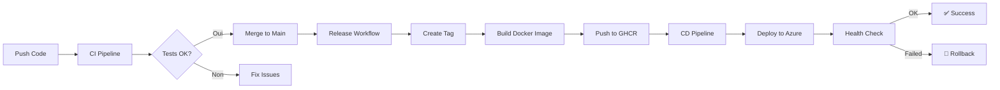

# 🚀 CI/CD avec GitHub Actions et Azure

> Tutoriel complet pour mettre en place une pipeline CI/CD professionnelle avec GitHub Actions et Azure Container Apps

[](https://github.com/gsoulat/fastapi-ci-cd/actions)
[](https://www.python.org/downloads/)
[](LICENSE)
[](https://github.com/astral-sh/ruff)


---

<div align="center" style="background-color: #ff0000; padding: 20px; border-radius: 10px; margin: 20px 0;">
  <h2 style="color: white; margin: 0;">🎥 TUTORIEL VIDÉO DISPONIBLE</h2>
  <p style="color: white; margin: 10px 0;">Regardez le tutoriel complet sur YouTube !</p>
  <a href="https://youtu.be/59Xy86Yhpj0" style="background-color: white; color: #ff0000; padding: 15px 30px; text-decoration: none; border-radius: 5px; font-weight: bold; display: inline-block; margin-top: 10px;">
    ▶️ VOIR LA VIDÉO
  </a>
</div>

---

## 📋 Table des matières

- [Vue d'ensemble](#-vue-densemble)
- [Architecture CI/CD](#-architecture-cicd)
- [Prérequis](#-prérequis)
- [Configuration GitHub Actions](#️-configuration-github-actions)
- [Configuration Azure](#️-configuration-azure)
- [Workflows disponibles](#-workflows-disponibles)
- [Guide de déploiement](#-guide-de-déploiement)
- [Secrets requis](#-secrets-requis)
- [Utilisation](#-utilisation)

---

## 🎯 Vue d'ensemble

Ce projet démontre l'implémentation d'une pipeline CI/CD complète pour une application Python avec:

- ✅ **Intégration Continue (CI)** : Tests automatiques, linting, type checking
- 🚀 **Déploiement Continu (CD)** : Déploiement automatique sur Azure Container Apps
- 📦 **Gestion des versions** : Semantic versioning automatique
- 🔄 **GitFlow** : Synchronisation automatique entre branches

---

## 🏗️ Architecture CI/CD



### Pipeline CI (`.github/workflows/ci.yml`)

Exécutée sur chaque push/PR vers `main` ou `develop`:

1. **Lint & Format** : Vérification du code avec Ruff
2. **Type Check** : Analyse statique avec MyPy
3. **Tests** : Exécution des tests avec Pytest (coverage minimum 60%)

### Pipeline CD (`.github/workflows/cd.yml`)

Déploiement automatique après création d'une release:

1. **Détermination de la version** à déployer
2. **Authentification Azure** via Service Principal
3. **Déploiement** sur Azure Container Apps
4. **Health Check** de l'application
5. **Rollback** automatique en cas d'échec

### Release (`.github/workflows/release.yml`)

Création automatique de versions sémantiques:

- Build et push d'images Docker sur GHCR
- Création de tags Git
- Génération de release notes

---

## 📦 Prérequis

### Outils nécessaires

- **Python 3.13+**
- **uv** (gestionnaire de paquets Python)
- **Docker** (pour tester en local)
- **Azure CLI** (pour la configuration Azure)
- **Compte GitHub** avec Actions activé
- **Compte Azure** avec un abonnement actif

### Installation locale

```bash
# Cloner le repository
git clone https://github.com/gsoulat/fastapi-ci-cd.git
cd fastapi-ci-cd

# Installer uv (si pas déjà installé)
curl -LsSf https://astral.sh/uv/install.sh | sh

# Installer les dépendances
uv sync --all-extras

# Lancer les tests
uv run pytest

# Lancer l'application en local
uv run uvicorn app.main:app --reload
```

---

## ⚙️ Configuration GitHub Actions

### 1. Activer GitHub Actions

Les workflows sont déjà configurés dans `.github/workflows/`. GitHub Actions les détecte automatiquement.

### 2. Configurer les secrets GitHub

Allez dans **Settings** → **Secrets and variables** → **Actions** et ajoutez:

| Secret | Description | Exemple |
|--------|-------------|---------|
| `AZURE_CREDENTIALS` | JSON du Service Principal Azure | `{"clientId": "xxx", "clientSecret": "xxx", ...}` |
| `AZURE_CONTAINER_APP_NAME` | Nom de votre Container App | `my-app-prod` |
| `AZURE_RESOURCE_GROUP` | Nom du Resource Group Azure | `my-rg-prod` |

### 3. Configurer les environnements

Créez des environnements dans **Settings** → **Environments**:

- `production` : Branche `main`
- `staging` : Branche `develop`
- `develop` : Environnement de développement

---

## ☁️ Configuration Azure

### 1. Créer un Service Principal

```bash
# Se connecter à Azure
az login

# Créer un Service Principal
az ad sp create-for-rbac \
  --name "github-actions-sp" \
  --role contributor \
  --scopes /subscriptions/{subscription-id}/resourceGroups/{resource-group} \
  --sdk-auth
```

Copiez le JSON résultant dans le secret `AZURE_CREDENTIALS`.

### 2. Créer une Container App

```bash
# Créer un Resource Group
az group create --name my-rg-prod --location westeurope

# Créer un Container Apps Environment
az containerapp env create \
  --name my-env \
  --resource-group my-rg-prod \
  --location westeurope

# Créer une Container App
az containerapp create \
  --name my-app-prod \
  --resource-group my-rg-prod \
  --environment my-env \
  --image mcr.microsoft.com/azuredocs/containerapps-helloworld:latest \
  --target-port 80 \
  --ingress external
```

### 3. Configurer l'authentification GHCR (optionnel)

```bash
# Créer un GitHub Personal Access Token (PAT) avec scope 'read:packages'
# Puis créer un secret dans Azure Container App
az containerapp secret set \
  --name my-app-prod \
  --resource-group my-rg-prod \
  --secrets ghcr-password={GITHUB_PAT}

# Configurer le registry
az containerapp registry set \
  --name my-app-prod \
  --resource-group my-rg-prod \
  --server ghcr.io \
  --username {GITHUB_USERNAME} \
  --password-secret-ref ghcr-password
```

---

## 🔄 Workflows disponibles

### CI - Intégration Continue

**Déclenchement** : Push/PR sur `main` ou `develop`

```bash
# Se déclenche automatiquement
git push origin develop
```

### Release - Création de version

**Déclenchement** : Push sur `main`

```bash
# Merger develop dans main pour créer une release
git checkout main
git merge develop
git push origin main
```

### CD - Déploiement Continu

**Déclenchement** : Automatique après Release ou manuel

```bash
# Via l'interface GitHub Actions
# 1. Aller dans Actions → CD
# 2. Cliquer sur "Run workflow"
# 3. Sélectionner l'environnement et la version
```

### Sync Main to Develop

**Déclenchement** : Automatique après push sur `main`

Synchronise automatiquement les changements de `main` vers `develop`.

---

## 🚀 Guide de déploiement

### Déploiement en production

1. **Développer sur une feature branch**
   ```bash
   git checkout -b feature/ma-nouvelle-feature
   # ... développer ...
   git push origin feature/ma-nouvelle-feature
   ```

2. **Créer une PR vers `develop`**
   - La CI s'exécute automatiquement
   - Fusionner après validation

3. **Tester sur staging** (optionnel)
   ```bash
   # Déployer manuellement develop sur staging
   # Via GitHub Actions → CD → Run workflow → staging
   ```

4. **Créer une PR de `develop` vers `main`**
   - Review finale
   - Fusionner

5. **Release automatique**
   - Le workflow Release se déclenche
   - Crée un tag (ex: `v1.2.3`)
   - Build et push l'image Docker

6. **Déploiement automatique**
   - Le workflow CD se déclenche
   - Déploie sur Azure Container Apps
   - Effectue un health check

---

## 🔐 Secrets requis

| Secret | Obligatoire | Description |
|--------|-------------|-------------|
| `AZURE_CREDENTIALS` | ✅ | Credentials du Service Principal Azure (JSON) |
| `AZURE_CONTAINER_APP_NAME` | ✅ | Nom de votre Azure Container App |
| `AZURE_RESOURCE_GROUP` | ✅ | Nom du Resource Group Azure |
| `AZURE_CLIENT_ID` | ⚠️ | Client ID pour OIDC (optionnel) |
| `AZURE_TENANT_ID` | ⚠️ | Tenant ID pour OIDC (optionnel) |
| `AZURE_SUBSCRIPTION_ID` | ⚠️ | Subscription ID pour OIDC (optionnel) |

---

## 🎓 Utilisation

### Commandes utiles

```bash
# Lancer les tests
uv run pytest --cov=app --cov-report=term

# Vérifier le code
uv run ruff check . --fix
uv run ruff format .

# Type checking
uv run mypy app

# Build Docker local
docker build -t my-app:local .
docker run -p 8000:8000 my-app:local

# Utiliser docker-compose
docker-compose up -d
```

### Structure du projet

```
.
├── .github/
│   └── workflows/          # Workflows GitHub Actions
│       ├── ci.yml          # Intégration continue
│       ├── cd.yml          # Déploiement continu
│       ├── release.yml     # Gestion des releases
│       └── sync-main-to-develop.yml
├── app/                    # Code de l'application
├── tests/                  # Tests unitaires
├── Dockerfile              # Configuration Docker
├── docker-compose.yml      # Orchestration locale
├── pyproject.toml          # Configuration Python
└── README.md               # Ce fichier
```

---

## 📚 Ressources

- [Documentation GitHub Actions](https://docs.github.com/en/actions)
- [Azure Container Apps](https://learn.microsoft.com/en-us/azure/container-apps/)
- [uv - Gestionnaire Python](https://github.com/astral-sh/uv)
- [Ruff - Linter Python](https://github.com/astral-sh/ruff)

---

## 🤝 Contribution

Les contributions sont les bienvenues ! N'hésitez pas à ouvrir une issue ou une PR.

---

## 📝 Licence

MIT License - voir le fichier [LICENSE](LICENSE) pour plus de détails.

---

<div align="center">
  <p>Fait avec ❤️ pour apprendre CI/CD</p>
  <p><strong>N'oubliez pas de regarder la vidéo YouTube ! 🎥</strong></p>
</div>